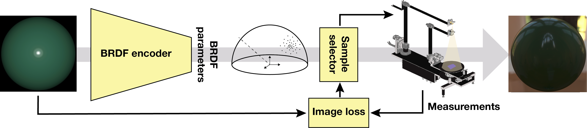

## Deep image-based Adaptive BRDF Measure
Example Open source of our GRAPP 2025 paper "Deep image-based Adaptive BRDF Measure"



[**Paper**](https://arxiv.org/abs/2410.02917)

[**Poster**](figs/GRAPP_2025_239.pdf)

[**Online Result Viewer**](https://arxiv.org/abs/2410.02917)


### Introduction
Efficient and accurate measurement of the bi-directional reflectance distribution function (BRDF) plays a key role in realistic image rendering. However, obtaining the reflectance properties of a material is both time-consuming and challenging. This paper presents a novel iterative method for minimizing the number of samples required for high quality BRDF capture using a gonio-reflectometer setup. The method is a two step approach, where the first step takes an image of the physical material as input and uses a lightweight neural network to estimate the parameters of an analytic BRDF model. The second step adaptive sample the measurements using the estimated BRDF model and an image loss to maximize the BRDF representation accuracy. This approach significantly accelerates the measurement process while maintaining a high level of accuracy and fidelity in the BRDF representatio.


### Citation
If you find our work useful in your research, please consider citing:
```
 
```

### POSTER


